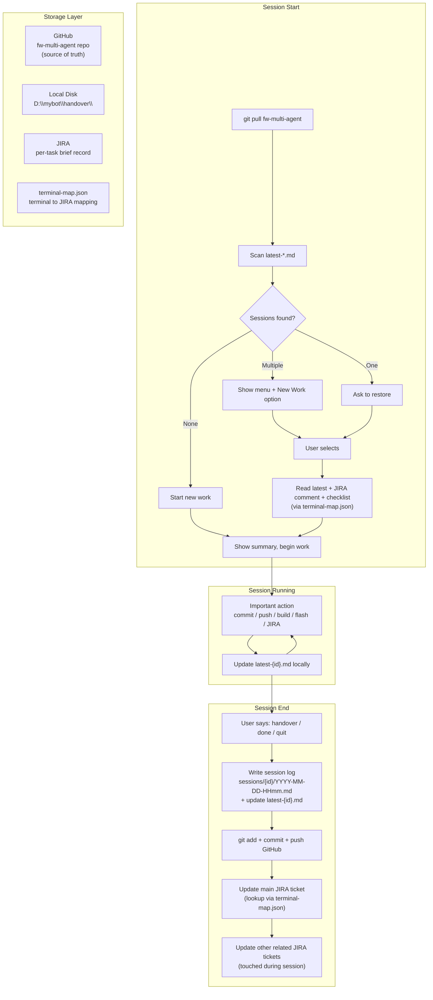

# Session Handoff Protocol

> Context Window = RAM, Filesystem = Disk, JIRA = per-task, GitHub = full session log

## Architecture Diagram

## Terminal Map

| Terminal | Working Dir | JIRA Tracker |
|----------|------------|--------------|
| reactor-fw | `D:\mybot\git\reactor-fw` | FWP-737 |
| reactor-50-100-fw | `D:\mybot\git\reactor-50-100-fw` | FWP-737 |
| esp32 | `D:\mybot\git\pg-reactor-esp32-wifi-bt` | FWP-738 |
| mybot | `D:\mybot` | FWP-739 |
| fw-multi-agent | `D:\mybot\fw-multi-agent` | FWP-739 |

## Lifecycle

1. **Start**: `git pull` -> scan `latest-*.md` -> present restore menu (or "New Work")
2. **Running**: update `latest-{id}.md` on every important action
3. **End**: write session log -> push GitHub -> update JIRA comments

## Key Principles

1. Code must be in mergeable state at session end
2. Never rely on context window -- write important info to disk
3. JIRA comments are brief; GitHub has full logs
4. Each terminal is independent
5. `git pull` on start, `git push` on end -- GitHub is source of truth
